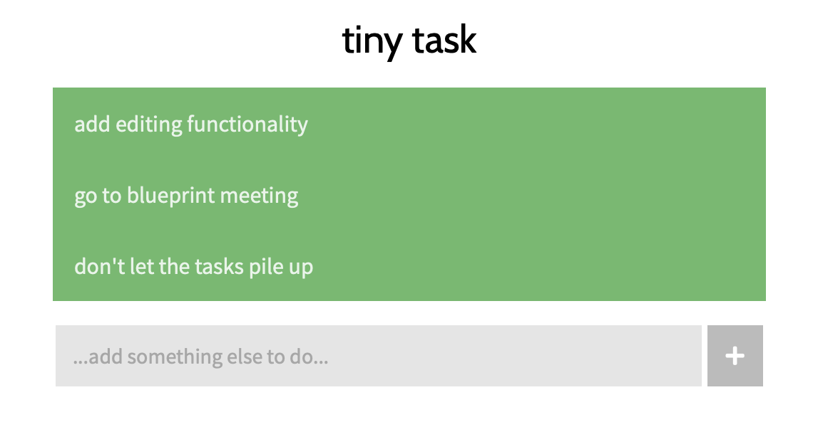

# tinytask

_A model Vue project in the form of tiny task manager._

## Purpose

It's a tiny tool for keeping track of tiny-ish tasks.

Also, it's a blueprint / model that I will rely on for structuring my own
future Vue projects.

## Project setup

```
yarn install # installs dependencies
yarn serve   # compiles and hot-reloads for development
yarn build   # compiles and minifies for production
yarn lint    # lints and fixes files
```

<br />
<br />
<p align="center"></p>
